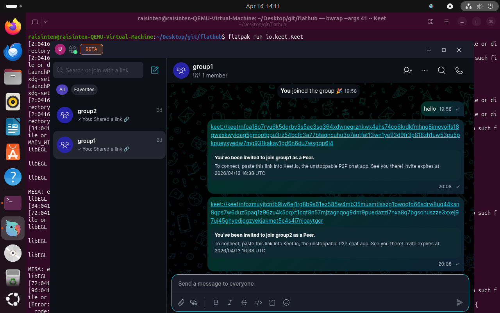

# Keet Flatpak

Github repo for the [Keet](https://keet.io) Flatpak.



Check out the [video demo](demo/flatpak-demo.webm).

## Install the Flatpak dependency

```sh
$ sudo apt install flatpak
$ flatpak remote-add --if-not-exists --user flathub https://dl.flathub.org/repo/flathub.flatpakrepo
$ flatpak install flathub org.flatpak.Builder
```

## Install the Keet Flatpak

```sh
$ git clone git@github.com:holepunchto/flathub.git
$ git checkout keet-app-submission

# For production (wait for the official keet-core env to be released first https://holepunchdev.slack.com/archives/C06K6KQLT0T/p1777278527978759?thread_ts=1776672658.896109&cid=C06K6KQLT0T)
$ flatpak run --command=flathub-build org.flatpak.Builder --disable-rofiles-fuse io.keet.Keet.yml

# For internal
$ flatpak run --command=flathub-build org.flatpak.Builder --disable-rofiles-fuse io.keet.Keet.yml

$ flatpak install --user ./repo io.keet.Keet
```

## Run

Using GUI: search Keet and run it

Or use CLI:

```sh
$ flatpak run io.keet.Keet
```

## Uninstall:

```
$ flatpak uninstall io.keet.Keet
```
